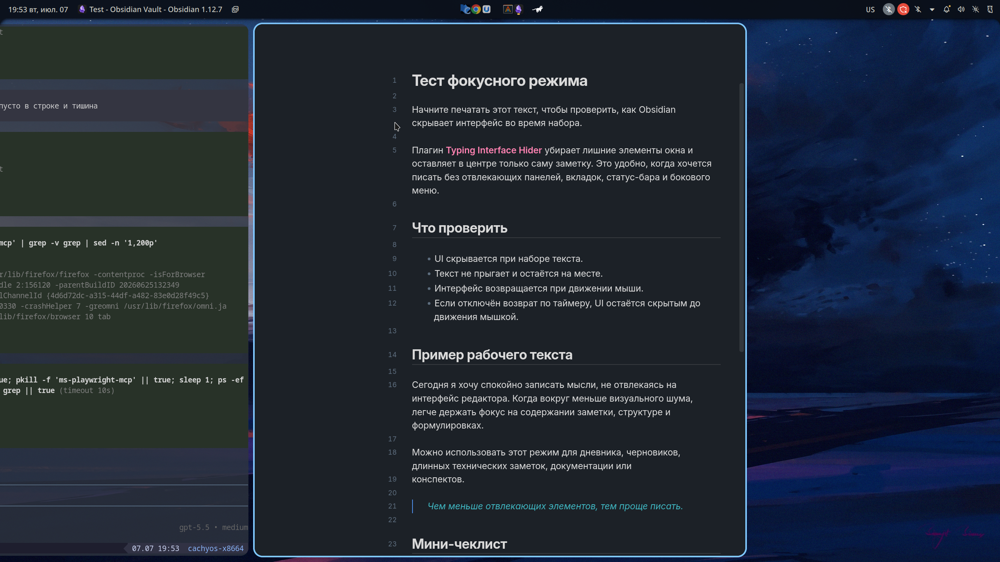
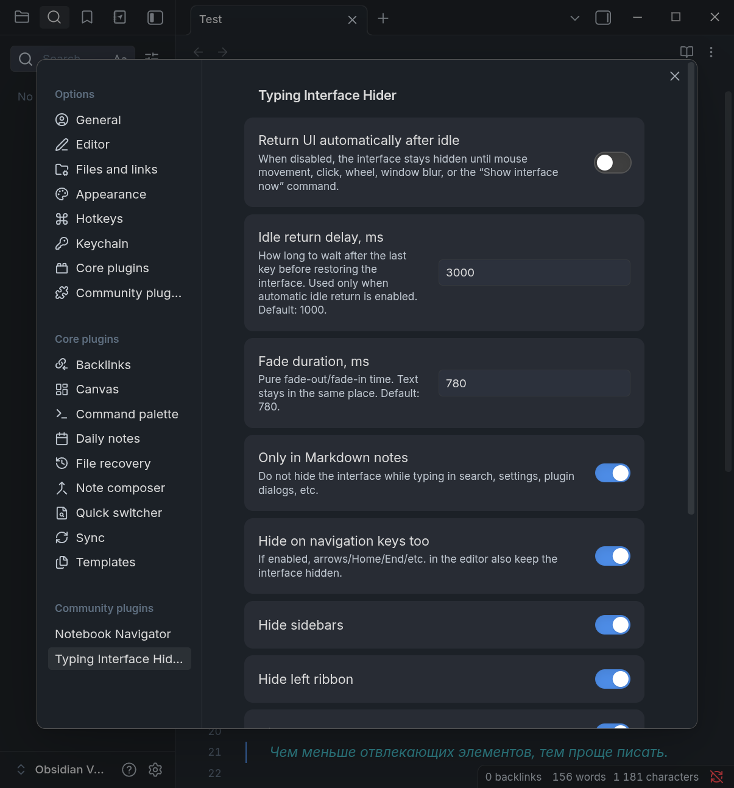

# Typing Interface Hider

Typing Interface Hider is an Obsidian plugin that hides selected parts of the Obsidian interface while you type, then brings them back when you stop typing or move the mouse.

It is useful for a lightweight focus/zen typing mode without changing the note layout.


## Screenshots

Typing focus mode:



Settings:



## Features

- Hide UI chrome while typing in Markdown notes.
- Restore the UI on mouse movement, click, scroll, or window blur.
- Optional automatic restore after an idle delay.
- Optional mouse-only restore mode: disable the idle timer and keep the UI hidden until you move the mouse.
- Configurable fade duration.
- Choose which UI areas to hide:
  - sidebars
  - left ribbon
  - tab headers
  - note header
  - status bar
  - window title bar
  - scrollbars

## Settings

- **Return UI automatically after idle**: when enabled, the UI returns after the configured idle delay. When disabled, the UI returns only on mouse/pointer activity, scroll, window blur, or the command below.
- **Idle return delay, ms**: delay before restoring the UI after typing stops.
- **Fade duration, ms**: fade-out/fade-in animation duration.
- **Only in Markdown notes**: avoid hiding the UI while typing in search, settings, plugin dialogs, and other Obsidian UI fields.
- **Hide on navigation keys too**: keep the UI hidden when using arrow/Home/End/Page keys in the editor.

## Commands

- **Show interface now**
- **Hide interface now**

## Manual installation

1. Download `main.js`, `manifest.json`, and `styles.css` from the latest release.
2. Create this directory in your vault:

   ```text
   <vault>/.obsidian/plugins/typing-interface-hider/
   ```

3. Copy the files into that directory.
4. Reload Obsidian.
5. Enable **Typing Interface Hider** in **Settings → Community plugins**.

## Development

This plugin is currently distributed as plain JavaScript without a build step.

To test locally, copy these files into an Obsidian vault plugin directory:

```text
.obsidian/plugins/typing-interface-hider/
├── main.js
├── manifest.json
└── styles.css
```

## License

MIT
